# Planner Backend

_Part of the [Planner Prototype](../README.md) project — see the root README for the full picture and the [frontend](../frontend/README.md) for the UI._

A working prototype of the "planner layer" proposal: instead of hard-wiring the
system to always run one fixed pipeline (log analysis), a user request is
routed at runtime to whichever skill(s) actually apply, in whatever order and
combination the request needs.

## Background

Today's baseline (pre-prototype) supports exactly one capability: log
analysis, implemented as a fixed, deterministic pipeline (discover → extract
→ clean → check → fuse). That's fine in isolation, but it doesn't generalize —
every new capability means hand-wiring a new deterministic pipeline into the
system, and the system has no way to decide *which* pipeline (or combination
of pipelines) a given request actually needs.

## Problem

Real requests aren't one-shot. "Create a platform, update a config file, and
also find me issues in the logs" needs three different capabilities composed
together, in order. Deterministic pipeline logic can execute a capability
once you've picked it, but it can't do the picking — that requires reasoning
about intent, which means an LLM has to sit *above* the pipelines, not
inside one of them.

## Proposed solution

Introduce a planner layer above the existing pipeline logic:

1. Take the user's query.
2. Read the set of available skills (and their descriptions) from a local
   registry (MCP server) — skills, tools, and pipelines.
3. Use an LLM to decide which skill(s) apply, and in what order.
4. Execute each planned step — a skill may be a single tool call or a
   multi-step pipeline; the planner doesn't need to know which in advance,
   the skill definition carries its own steps.
5. Fuse whatever steps ran into one result for the user.

This decouples *what capability runs* from *how that capability is
implemented*. Log analysis becomes one skill among many rather than the only
thing the system can do — adding a new capability means declaring a new skill
in the registry, not touching the planner.

## What this prototype adds beyond the original design

The design above assumes the planner can just "read the set of available
skills" and hand them all to the LLM. That works at a handful of skills; this
prototype's registry ([skills_library.jsonl](skills_library.jsonl)) already
has **42**, covering VP lifecycle, Theia workspace/file ops, build/debug/git,
jobs, licensing/settings, and diagnostics — dumping all 42 descriptions plus
schemas into every planning call wastes context and gives the LLM more
irrelevant surface area to pick a wrong tool from.

So there's a retrieval step in front of the LLM planner that the original
diagram doesn't show: a **semantic vector search** narrows 42 skills down to
a handful of relevant candidates *before* the LLM ever sees them. That
narrowing is also where compound requests get handled — see
[Architecture](#architecture) below.

## Architecture



```
User query
    │
    ▼
1. Decompose (LLM, cheap call)
   "create a vp and find issues in the logs"
     → ["create a vp", "find issues in the logs"]
   A single-ask query decomposes to just itself — decomposition is always
   attempted, but only changes behavior when the request is actually compound.
    │
    ▼
2. Semantic retrieval (numpy cosine-similarity, one search per decomposed item, in parallel)
   Each item is embedded (BAAI/bge-m3) and scored against every skill
   description in the vector store. Results are merged across items,
   deduped by skill id (keeping the best score seen), and ranked.
    │
    ▼
3. LLM planner (second LLM call)
   Given the query + the merged candidate shortlist (id, description,
   input/output schema — NOT the full 42-skill catalog), decide which
   candidate skill(s) to call, in what order, with what parameters.
   Produces an ordered JSON plan; a step can reference an earlier step's
   output via a "<from:STEP_INDEX.FIELD>" placeholder instead of guessing.
    │
    ▼
4. Local MCP execution
   Each step runs as an MCP tool call (not a direct function call) so a
   tool can *elicit* a missing required parameter interactively instead of
   just failing. Placeholders are resolved against prior steps' real
   outputs immediately before each call.
    │
    ▼
5. Results
   Every step reports its own ok/error status independently — one failed
   step doesn't abort the rest of the plan. Results (or, for a no-tool-call
   request like "hello", a direct conversational reply) are returned to
   the user.
```

Skills stay declarative and (where useful) deterministic under the hood —
`analyze_logs_pipeline` is still the same fixed discover → extract → clean →
check → fuse sequence it always was, it's just invoked *by the planner's
decision* now instead of being the only thing the system can do.

## Repo layout

| File | Role |
|---|---|
| [planner.py](planner.py) | Entry point. Retrieval → decompose → LLM plan → MCP execution loop, plus the interactive CLI. |
| [embed_skills.py](embed_skills.py) | Builds/queries the numpy vector store (`skills_index/`) from `skills_library.jsonl` using BAAI/bge-m3 via the HF Inference API. Current default retrieval backend. |
| [chroma_store.py](chroma_store.py) | Drop-in Chroma-backed alternative to the numpy store — same `build`/`search` interface, for when the numpy prototype needs to graduate to a real vector DB. |
| [mcp_server.py](mcp_server.py) | FastMCP server exposing every skill as a typed MCP tool, plus `list_skills` and `run_plan` meta-tools. Handles parameter elicitation. |
| [tools.py](tools.py) | The actual skill implementations, backed by simple in-memory state stores (VPs, workspaces, files, jobs, ...). Resets on restart. |
| [skills_library.jsonl](skills_library.jsonl) | The skill registry/catalog — id, description, tags, declared steps, input/output schema. One line per skill. |
| [llm/llm.py](llm/llm.py) | Swappable LLM client (Google Gemini). No pipeline logic lives here by design. |
| [prompts.txt](prompts.txt) | Manual test sessions (empty-store errors, pick-list elicitation, decomposition, `<from:>` chaining, no-tool-call replies). |
| [server.py](server.py) | FastAPI backend for the web frontend (`../frontend`) — REST + WebSocket wrapper around `planner.plan_and_run`. See below. |

## Running it

```bash
pip install -r requirements.txt
# .env (repo root, one level above MCP_Tool_Prototype) needs HF_TOKEN (for
# embeddings) and GOOGLE_API_KEY (see llm/llm.py)

python embed_skills.py build          # embeds skills_library.jsonl -> skills_index/
python planner.py "create a vp for customer acme and then snapshot it"

# or interactively:
python planner.py
```

## Web frontend

`server.py` exposes the same planning flow over HTTP/WebSocket for the React
frontend in [`../frontend`](../frontend):

```bash
# from this directory (backend/):
uvicorn server:app --reload --port 8000
```

```bash
# in a second terminal, from ../frontend:
npm install   # first time only
npm run dev   # http://localhost:5173
```

Endpoints:

| Route | Purpose |
|---|---|
| `GET /api/health` | Liveness check. |
| `GET /api/skills` | The full skill catalog (for the frontend's sidebar). |
| `POST /api/plan` | One-shot planning turn; any elicitation is auto-declined. |
| `WS /ws/plan` | Interactive planning turn: streams `subtasks` / `candidates` / `plan` / `step_start` / `step` / `done` events as they happen, and forwards each elicitation request (`elicit`, with `kind: "text" \| "choice" \| "form"`) to the client, waiting for an `elicit_response` message before the underlying tool call continues. This is what lets the browser prompt the user the same way the CLI's `input()` does. |

## Example walkthrough

Query: *"create a platform, update a config file, and also find me issues in
the logs"*

1. **Decompose** → 3 subtasks (create a platform / update a config file / find
   issues in the logs).
2. **Retrieve** → each subtask is searched independently; `create_vp`,
   `update_file`, and `analyze_logs_pipeline` each rank highly on their own
   subtask even though the combined sentence would have diluted at least one
   of them below the cutoff.
3. **Plan** → LLM returns a 3-step ordered plan: `create_vp` → `update_file`
   → `analyze_logs_pipeline`, with placeholders where a later step needs an
   earlier one's output (e.g. the new VP's id).
4. **Execute** → each step runs through MCP; any still-missing required
   parameter (which config file, which workspace) is elicited from the user
   interactively instead of guessed or failed.
5. **Result** → three independent ok/error results returned together.

## Testing

[prompts.txt](prompts.txt) is a manual test script covering: empty-store
fail-fast messages, single- and multi-choice pick-list elicitation, free-text
elicitation, multi-step decomposition, `<from:>` output chaining, the
no-tool-call conversational path, and read-only tools that need no
elicitation at all. Run each session's queries in order through
`python planner.py`.
